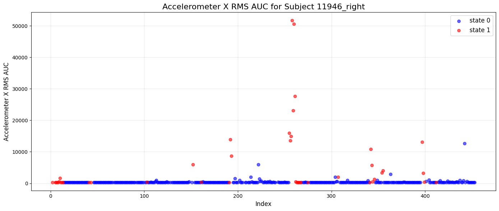
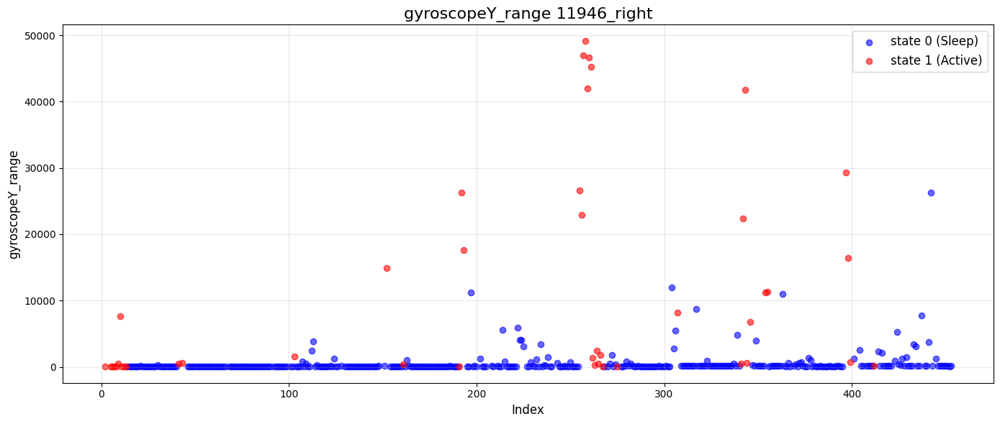

# 🚀 Sleep–Wake Detection using Multimodal Wearable Sensors

This repository contains a complete **multimodal sleep–wake detection pipeline** using physiological and motion sensor data. It includes **preprocessing**, **feature extraction**, and **model training** for classifying sleep and wake states using LED/PPG, accelerometer, gyroscope, and temperature signals.

The project is organized into Jupyter notebooks for workflow transparency and a `utils/` package containing reusable preprocessing and feature extraction modules.

---


##  Environment Setup

- **Python 3.11**
- Install dependencies via:
  ```bash
  pip install -r requirements.txt


## 📁 Repository Structure

```bash
sleep-wake-detection/
│
├── 01_preprocess.ipynb                 # Data loading, cleaning, alignment, windowing
├── 02_model.ipynb                      # Model training and evaluation
│
├── utils/
│   ├── filters.py                      # Filtering utilities
│   ├── spectral_features.py            # FFT/PSD-based features
│   ├── statistical_features.py         # Statistical time-domain features
│   ├── led_feature_extraction.py       # LED/PPG feature extraction
│   │
│   └── multimodal/
│       ├── acc_gyro_processing.py      # Accelerometer/Gyroscope preprocessing
│       ├── led_processing.py           # LED/PPG preprocessing pipeline
│       ├── temp_processing.py          # Temperature preprocessing utilities
│
├── assets/
│   ├── accelerometer.png               # Example accelerometer feature visualization
│   └── gyroscope.png                   # Example gyroscope feature visualization
│
└── README.md
```


---

## 🎯 Project Overview

This repository implements a **sleep–wake classification system** designed for multimodal wearable devices. It supports:

- **LED/PPG signals** (heart rate, HRV, amplitude, SNR)
- **Accelerometer + Gyroscope** (movement magnitude, variance, bursts)
- **Temperature** (baseline, change rate, variability)
- **Derived statistical and spectral features**
- **Window-based feature engineering**
- **Machine learning classification models**

The pipeline is fully modular and can be adapted to different datasets or devices.

---

## 🔧 Core Functionalities

### 🟦 1. Multimodal Preprocessing (`utils/multimodal/`)

Includes sensor-specific pipelines:

- **LED/PPG preprocessing**
  - Filtering and smoothing
  - Peak detection
  - Motion artifact mitigation

- **Accelerometer & Gyroscope**
  - Signal magnitude area (SMA)
  - Orientation-independent metrics
  - Activity burst detection

- **Temperature**
  - Baseline correction
  - Rate-of-change features
  - Outlier detection

---

### 🟩 2. Feature Extraction (`utils/`)

- **Statistical time-domain features**
  - mean, std, variance, skewness, kurtosis
  - rolling window aggregates

- **Spectral features**
  - FFT components
  - Power spectral density
  - Band-limited energy

- **LED/PPG features**
  - amplitude
  - rise/fall slopes
  - HR/HRV derivatives

- **Custom filtering utilities**
  - Butterworth filters
  - Low/high-pass smoothing
  - Noise conditioning

## 📊 Example Labeled Feature Visualizations

Below are two examples of **window-level features** generated from the accelerometer and gyroscope sensors, with points color-coded by the sleep/wake target label.

### 1️⃣ Accelerometer Feature Example — RMS AUC

This visualization shows how **Accelerometer X RMS AUC** highlights motion bursts during wake periods (red), while sleep periods (blue) remain close to zero.

<p align="center">
  
</p>

---

### 2️⃣ Gyroscope Feature Example — Range

This plot illustrates **Gyroscope Y-axis range**, where large spikes correspond to high-intensity motion during wake states.  
Blue points indicate sleep windows with minimal variability.

<p align="center">
  
</p>

---

### 🟥 3. Sleep–Wake Classification (`02_model.ipynb`)

Includes:

- Train/validation/test splits  
- Feature scaling and normalization  
- Model training (ML or neural networks)  
- Model evaluation metrics:
  - Accuracy
  - F1-score
  - ROC-AUC
- Confusion matrix visualization  
- Feature importance (Random Forest / XGBoost)  

---

## 📦 Installation

Clone the repository:

```bash
git clone https://github.com/<your-username>/sleep-wake-detection.git
cd sleep-wake-detection
```

License
This project is licensed under the MIT License — see the LICENSE